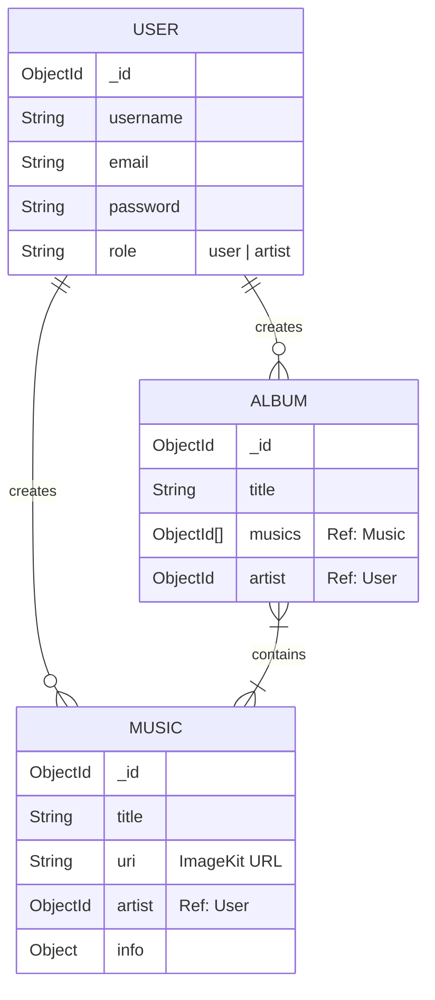
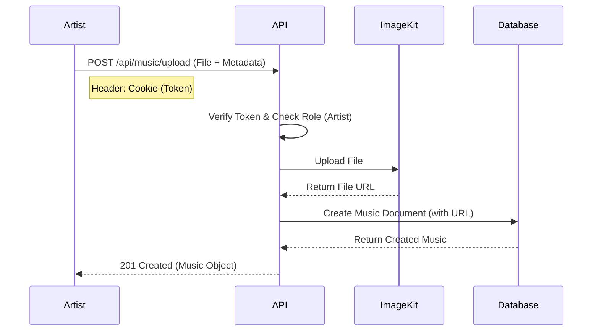

# Spotify Backend Playground

Welcome to the **Spotify Backend Playground**! This project is a backend implementation for a music streaming service, built with Node.js, Express, and MongoDB. It handles user authentication, music uploads (using ImageKit), and album creation.

## 🚀 Tech Stack

- **Runtime**: [Node.js](https://nodejs.org/)
- **Framework**: [Express.js](https://expressjs.com/)
- **Database**: [MongoDB](https://www.mongodb.com/) (Mongoose ODM)
- **Authentication**: JWT (JSON Web Tokens) & bcryptjs
- **File Storage**: [ImageKit](https://imagekit.io/)
- **File Handling**: Multer

---

## 📂 Project Structure

```bash
Backend/
├── src/
│   ├── config/             # Database configuration
│   ├── controllers/        # Request handlers (Auth, Music)
│   ├── middlewares/        # Custom middlewares (Authentication)
│   ├── models/             # Mongoose schemas (User, Music, Album)
│   ├── routes/             # API route definitions
│   ├── services/           # External services (ImageKit storage)
│   └── app.js              # Express app setup
├── server.js               # Entry point
└── ...
```

---

## 📊 Database Schema (ER Diagram)

This diagram shows the relationships between Users (Artists), Music tracks, and Albums.



---

## 🔄 Application Flow

### Music Upload Flow



---

## 🔌 API Endpoints

### 🔐 Authentication (`/api/auth`)

#### 1. Signup
- **Endpoint**: `POST /api/auth/signup`
- **Body**:
  ```json
  {
    "username": "artist_jane",
    "email": "jane@example.com",
    "password": "StrongPassword123!",
    "role": "artist"  // Optional, default is "user"
  }
  ```

#### 2. Login
- **Endpoint**: `POST /api/auth/login`
- **Body**:
  ```json
  {
    "email": "jane@example.com", 
    "password": "StrongPassword123!"
  }
  ```
- **Response**: Sets a `token` cookie and returns user info.

---

### 🎵 Music (`/api/music`)

**Note**: These endpoints require a valid `token` cookie and the user must have the `role: "artist"`.

#### 1. Upload Music
- **Endpoint**: `POST /api/music/upload`
- **Content-Type**: `multipart/form-data`
- **Body**:
    - `music`: (File) The audio file to upload.
    - `title`: (String) Title of the track.
    - `info`: (Object/String) Additional metadata.
- **Example**:
  Use Postman or a frontend form to send the file and fields.

#### 2. Create Album
- **Endpoint**: `POST /api/music/create-album`
- **Content-Type**: `application/json` or `application/x-www-form-urlencoded`
- **Body**:
  ```json
  {
    "title": "My Debut Album",
    "musics": [
      "65ca... (Music ObjectId 1)",
      "65cb... (Music ObjectId 2)"
    ]
  }
  ```

#### 3. Get All Music
- **Endpoint**: `GET /api/music/`
- **Description**: Returns a limited list (max 2) of music tracks.
- **Features**:
  - Uses `.limit(2)` to restrict results.
  - Uses `.select("uri title artist")` to return specific fields.
  - Uses `.populate("artist", "username")` to replace the artist ID with the actual username.
- **Response**:
  ```json
  {
    "message": "Music fetched successfully",
    "musics": [
      {
        "_id": "65ca...",
        "title": "Song Title",
        "uri": "https://ik.imagekit.io/...",
        "artist": {
          "_id": "65aa...",
          "username": "artist_jane"
        }
      }
    ]
  }
  ```

### 💿 Albums (`/api/music/album`)

#### 1. Get All Albums
- **Endpoint**: `GET /api/music/album`
- **Description**: Fetches all albums with artist details populated.

#### 2. Get Album By ID
- **Endpoint**: `GET /api/music/album/:id`
- **Description**: Fetches a single album, populating both the `artist` (username) and `musics` (uri, title, artist) details.

---

### � Authentication Updates

#### 3. Logout
- **Endpoint**: `POST /api/auth/logout`
- **Description**: Clears the authentication token cookie.

---

## 🧠 Key Mongoose Concepts Used

- **Population (`.populate()`)**: Automatically replaces a reference ID (like `artist`) in a document with the actual data from the referenced collection (User).
- **Selection (`.select()`)**: distincts which fields to return or exclude (e.g., returning only `title` and `uri` instead of the whole object).
- **Limiting (`.limit()`)**: Restricts the number of results returned by a query (used in `getAllMusic` to show only 2 songs).

1.  **Clone the repository**.
2.  **Install dependencies**:
    ```bash
    npm install
    ```
3.  **Environment Variables**:
    Create a `.env` file in the root directory:
    ```env
    PORT=3000
    MONGODB_URI=your_mongodb_connection_string
    JWT_SECRET=your_jwt_secret
    IMAGEKIT_PRIVATE_KEY=your_imagekit_private_key
    # Add other ImageKit keys if needed in storage.service.js
    ```
4.  **Run the server**:
    ```bash
    npm run start
    # OR for development
    npm run dev
    ```

## 📝 License
This project is for educational purposes.
